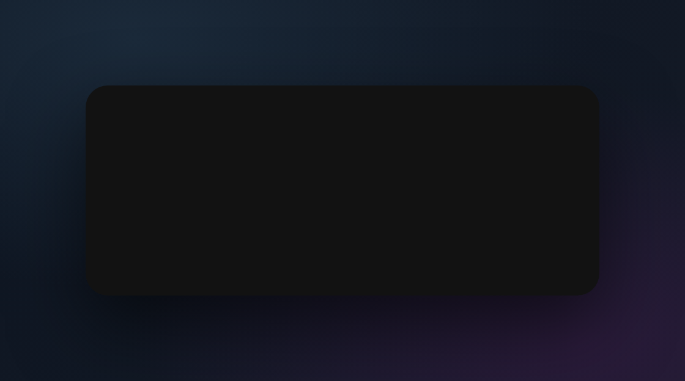
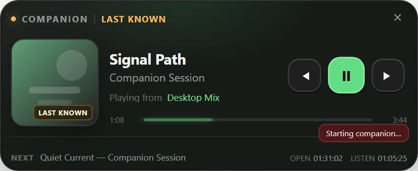
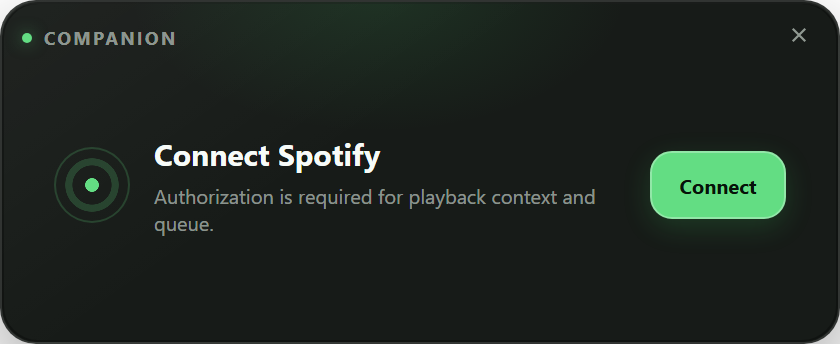
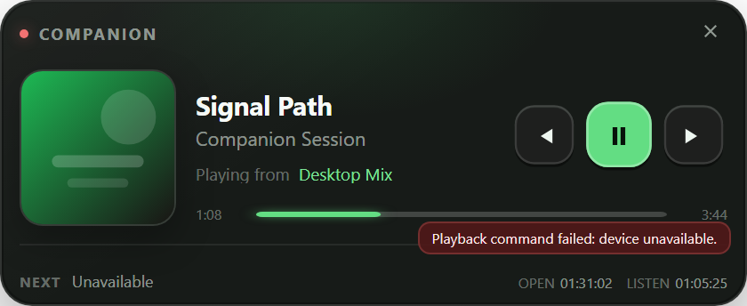
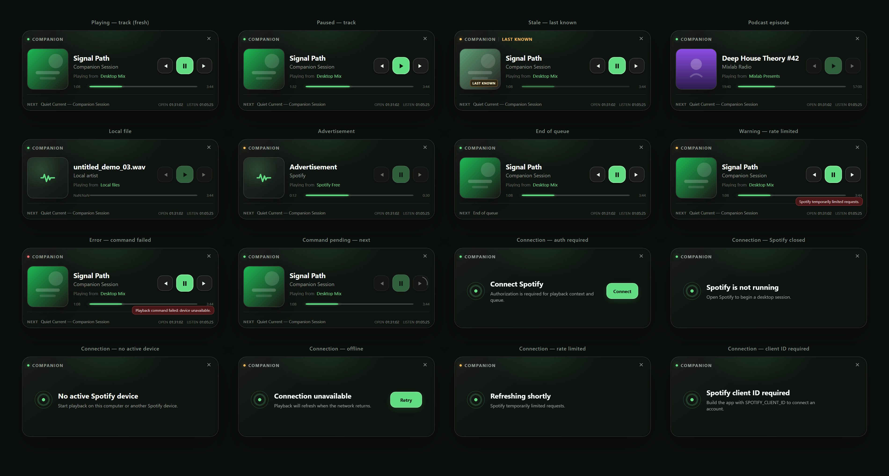

<p align="center">
  
</p>

<h1 align="center">Spotify Companion Widget</h1>

<p align="center">
  A compact Windows tray and macOS menu-bar companion for an existing Spotify playback session.<br />
  Displays the current item, context, queue, progress, and session timers and provides previous,
  play/pause, and next controls without replacing the Spotify client.
</p>

The application uses Tauri 2, React 18, TypeScript, and Rust. Windows integrates with GSMTC for
low-latency local media behavior; the Spotify Web API supplies account playback, queue, context, and
cross-device controls. macOS uses a floating `NSPanel` with accessory activation policy.

Spotify Companion Widget is an independent GPL-3.0 project. It is not affiliated with, endorsed by,
or sponsored by Spotify AB.

## Screenshots



_A live playback session: artwork, title, context, transport, progress, next item, and session timers._



_Stale state: the widget shows the last known track with a desaturated artwork badge and warning signal._



_The connection prompt when Spotify authorization is needed to access playback context and queue._



_An error banner overlay when a playback command fails — the widget stays functional and reports the failure._

### Full UI state taxonomy



_All 16 renderable states: playing, paused, stale, podcast, local file, advertisement, end of queue, warning, error, command pending, and six connection prompts (auth required, Spotify closed, no active device, offline, rate limited, client ID required)._

## Product behavior

- Fixed 420×172 logical-pixel frameless widget with system light/dark and high-contrast support
- Tray/menu-bar lifecycle, close-to-hide, single-instance raise, and launch-at-login
- Secure Spotify Authorization Code with PKCE S256
- Windows Credential Manager and macOS Keychain refresh-token storage
- Track, episode, local, advertisement, null, and unknown item handling
- Context and next-item display with explicit fresh, stale, offline, and rate-limited states
- Monotonic Spotify-open and confirmed-listening timers with suspend-gap exclusion
- Atomic settings/session persistence and monitor/DPI position recovery
- Signed NSIS/MSI and universal macOS app/DMG release workflows when credentials are present

## Prerequisites

- Node.js 22 or newer
- pnpm 11 (the `packageManager` field selects the repository version)
- Rust 1.95 or newer
- Windows: Visual Studio Build Tools with Desktop development with C++ and WebView2 Runtime
- macOS: Xcode command-line tools; Xcode is required for signed packaging

## Spotify application

1. Create an app in the [Spotify Developer Dashboard](https://developer.spotify.com/dashboard).
2. Register this redirect URI exactly:

   `http://127.0.0.1/callback`

   Spotify permits a dynamic port in authorization requests for a registered loopback IP literal.
   `localhost` is not accepted.

3. Copy the Client ID. A client secret is neither required nor supported by this public PKCE client.
4. Provide the Client ID while compiling:

   PowerShell:

   ```powershell
   $env:SPOTIFY_CLIENT_ID = "your-client-id"
   pnpm tauri dev
   ```

   macOS shell:

   ```sh
   SPOTIFY_CLIENT_ID=your-client-id pnpm tauri dev
   ```

The app requests only:

- `user-read-playback-state`
- `user-read-currently-playing`
- `user-modify-playback-state`

## Development

```sh
pnpm install
pnpm tauri dev
```

`pnpm dev` runs a browser-only visual preview with fixture playback data. Native commands require
`pnpm tauri dev`.

Verification commands:

```sh
pnpm check
cd src-tauri
cargo fmt --check
cargo clippy --all-targets -- -D warnings
cargo test
```

The complete gate and native smoke checks are in [docs/release-checklist.md](docs/release-checklist.md).

## Packaging

Windows:

```powershell
$env:SPOTIFY_CLIENT_ID = "your-client-id"
pnpm tauri build --bundles nsis,msi
```

macOS universal:

```sh
SPOTIFY_CLIENT_ID=your-client-id \
pnpm tauri build --target universal-apple-darwin --bundles app,dmg
```

Unsigned local packages support development only. Public releases require the credentials and policy
checks listed below.

## CI and release secrets

Common:

- `SPOTIFY_CLIENT_ID`

Windows:

- `WINDOWS_CERTIFICATE_BASE64`
- `WINDOWS_CERTIFICATE_PASSWORD`

macOS:

- `APPLE_CERTIFICATE_BASE64`
- `APPLE_CERTIFICATE_PASSWORD`
- `APPLE_SIGNING_IDENTITY`
- `APPLE_ID`
- `APPLE_APP_SPECIFIC_PASSWORD`
- `APPLE_TEAM_ID`

`.github/workflows/release.yml` imports signing identities only on hosted runners. Tauri submits and
staples macOS notarization when all Apple notarization variables are present. Missing signing
credentials produce development artifacts, not a production release candidate.

## Local data and privacy

The application stores:

- Refresh token: native credential store only
- Access token: process memory only
- Settings: versioned JSON in the operating-system application config directory
- Session checkpoint and redacted logs: operating-system local data directory

The application does not run analytics, operate a server, collect listening history, or transmit
data anywhere except Spotify accounts/API endpoints. Album artwork loads directly from allowlisted
Spotify CDN hosts. Reset Local Data deletes the native refresh credential, settings, checkpoints,
logs, and cache data.

Logs rotate at 5 MiB with five retained files. Tokens, authorization callbacks, raw API payloads, and
artwork URLs do not enter logs.

## Design and security

- [Architecture](docs/architecture.md)
- [Threat model](docs/threat-model.md)
- [Release checklist](docs/release-checklist.md)
- [Third-party notices](THIRD_PARTY_NOTICES.md)

The shipped UI contains product-specific adaptations of selected AudioUI SVG, interaction, and
CSS-variable patterns. The untracked `audio-ui-templates` reference monorepo is not a runtime or
packaging dependency.

## License

Copyright © 2026 Vladislav Kondratyev.

Spotify Companion Widget is free software under GPL-3.0-only. See [LICENSE](LICENSE). AudioUI-derived
files retain their upstream notice and GPL-3.0 attribution.
