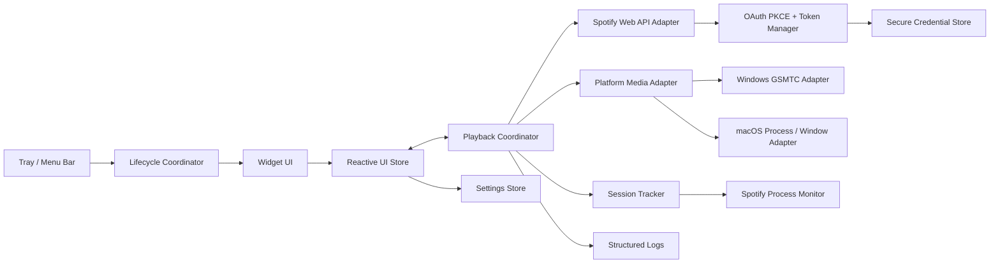
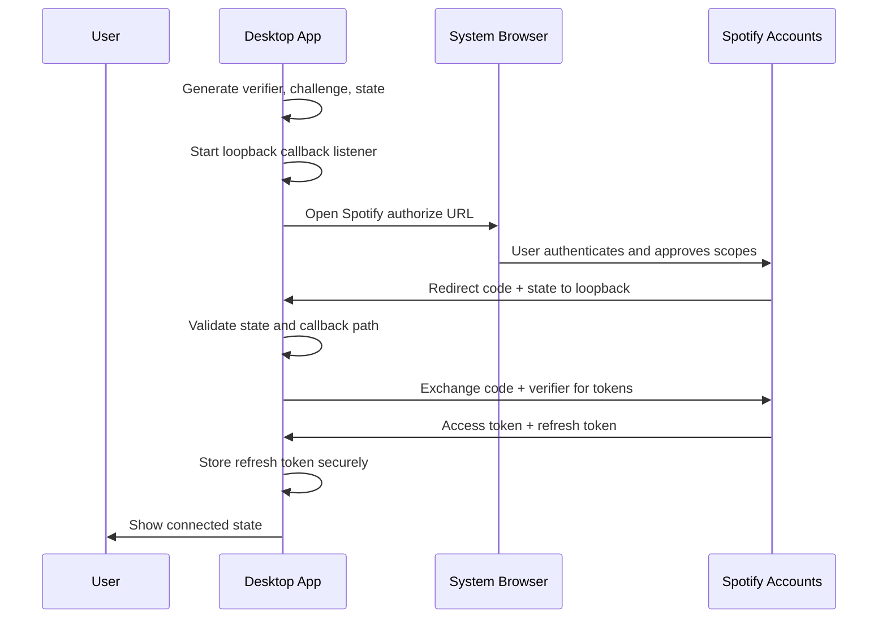
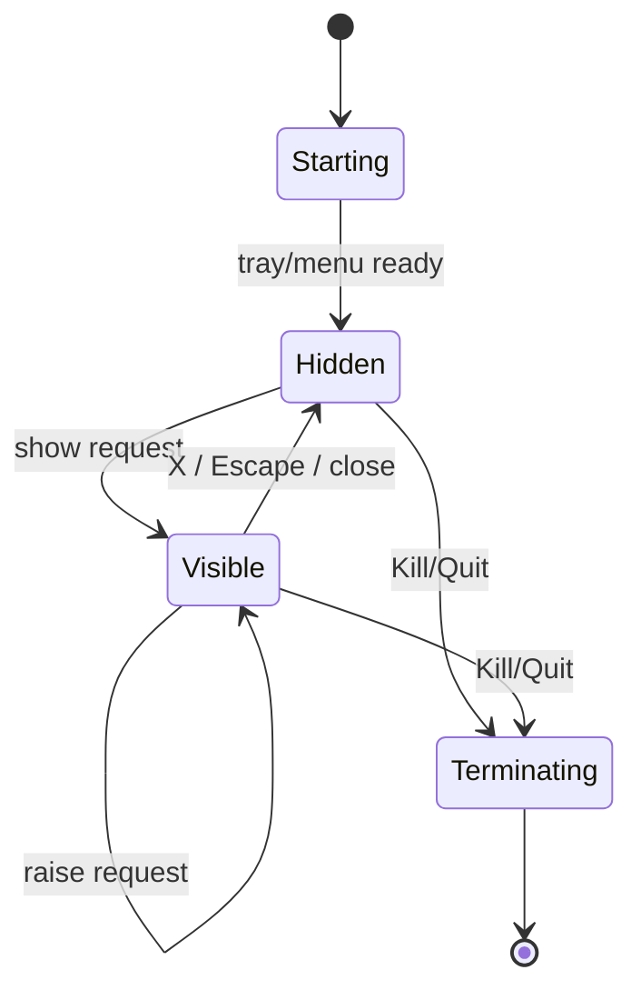
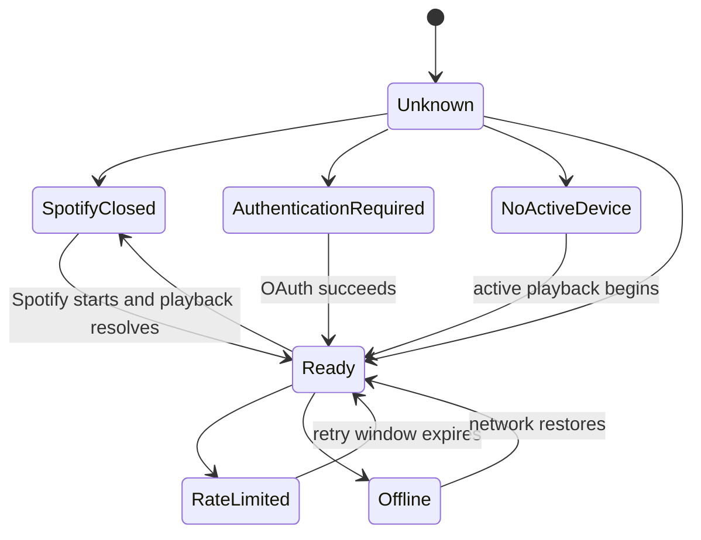

# Desktop Spotify Companion Widget

## Product Development Document

**Working title:** Spotify Companion Widget  
**Document type:** Product Development Document (PDD)  
**Platforms:** Windows 11 and macOS 13+  
**Status:** Draft for implementation  
**Version:** 1.0  
**Last updated:** 2026-07-12  
**Primary use case:** Personal desktop utility that controls and displays an existing Spotify playback session without replacing the Spotify application.

---

## 1. Executive Summary

The Spotify Companion Widget is a small desktop utility that lives in the operating system's persistent status area:

- **Windows:** notification area/system tray, normally in the bottom-right taskbar region.
- **macOS:** menu bar, normally in the top-right region.

Clicking the status icon reveals a compact, movable playback widget. The widget remains above normal application windows, displays the current track and playback context, exposes basic playback controls, shows the next queued item, and tracks the duration of the current Spotify application session.

The product is **not a music player, streaming client, or Spotify replacement**. It does not decode, stream, cache, or alter audio. It acts as a companion to an existing Spotify account and active Spotify playback device.

The application lifecycle is intentionally different from a normal desktop app:

- Clicking the widget's `X` hides the widget.
- Closing the popup does not terminate the process.
- The background process remains available through the tray/menu-bar icon.
- The normal application termination command is available only from the tray/menu-bar context menu as **Kill Application** or **Quit Application**.
- The operating system can still terminate the process through shutdown, logout, Task Manager, Activity Monitor, force quit, crashes, or external process management. The product can control its own UI semantics, not the operating system.

The recommended implementation is a single cross-platform codebase built with **Tauri 2, Rust, and Svelte/TypeScript**, with platform-specific adapters for Windows and macOS integration. Spotify Web API is the shared source of truth for account playback state, context, and queue. Windows additionally uses the public Global System Media Transport Controls API for low-latency local metadata and playback commands. macOS uses Spotify Web API as the supported control path; optional Apple Events integration may be explored later but must not be required for MVP operation.

---

## 2. Product Thesis

Spotify is already capable of playing music. The problem is interaction cost.

A user working in a full-screen editor, browser, terminal, game, design tool, or remote session must either:

1. use global media keys with limited visibility,
2. open Spotify and interrupt the current task,
3. use an operating-system media overlay that disappears quickly, or
4. use a generic desktop widget with weak Spotify context.

The proposed product reduces that interaction to a persistent, compact control surface that is visible when needed and absent when not needed.

### 2.1 Core promise

> Control and inspect the current Spotify session without opening Spotify or leaving the active workflow.

### 2.2 Product principles

1. **Companion, not replacement** — Spotify remains the playback engine and source of audio.
2. **One-click access** — status icon to usable controls in one click.
3. **No accidental shutdown** — closing hides; explicit status-menu action terminates.
4. **Always available, never intrusive** — topmost when visible, hidden when dismissed.
5. **Truth over fabricated state** — unknown queue or context is displayed as unknown.
6. **Low system cost** — small memory footprint, negligible idle CPU, controlled network polling.
7. **Native behavior by platform** — Windows tray and macOS menu bar should feel correct on their respective operating systems.
8. **Privacy by default** — no backend is required for the personal version; tokens and settings remain local.

---

## 3. Goals and Non-Goals

## 3.1 Product goals

| ID | Goal | Success condition |
|---|---|---|
| G-01 | Provide immediate playback controls | Previous, play/pause, and next execute successfully against the active Spotify session |
| G-02 | Surface useful playback information | Current title, artist, artwork, context, next item, and progress are available when Spotify exposes them |
| G-03 | Remain accessible across workflows | Widget stays above normal windows and can be repositioned |
| G-04 | Prevent accidental termination | Widget close action hides instead of exiting |
| G-05 | Support Windows and macOS | Functional parity for all core features, with documented platform-specific behavior |
| G-06 | Minimize resource consumption | Idle CPU remains near zero and API polling is event-driven or visibility-aware |
| G-07 | Survive normal desktop changes | Handles Spotify restarts, network loss, token refresh, monitor changes, sleep, and resume |
| G-08 | Be safe to maintain | Clear architecture, testable state machine, structured logs, and no undocumented platform hacks in the required path |

## 3.2 Non-goals for MVP

The MVP will not:

- stream audio;
- become a Spotify Connect playback device;
- search the Spotify catalog;
- browse entire playlists;
- manage the user's library;
- create or edit playlists;
- display lyrics;
- download music or artwork for offline use;
- synchronize Spotify audio with video or visual content;
- support Apple Music, YouTube Music, Tidal, or other providers;
- provide social activity or public user profiles;
- include a cloud backend;
- guarantee visibility above protected operating-system surfaces, secure desktops, system permission dialogs, or every exclusive full-screen application;
- prevent termination through Task Manager, Activity Monitor, operating-system shutdown, crash, or force-quit mechanisms.

## 3.3 Future expansion candidates

- volume, shuffle, repeat, and seek controls;
- compact and expanded display modes;
- configurable keyboard shortcuts;
- mini queue view;
- desktop edge docking;
- multiple visual themes;
- additional media providers through a provider abstraction;
- optional listening analytics stored locally;
- optional local integration with media-session APIs where public and stable.

---

## 4. Target Users and Use Cases

## 4.1 Primary persona

**Power desktop user**

- spends long sessions in IDEs, terminals, browsers, games, design tools, or remote desktops;
- uses Spotify continuously while working;
- dislikes switching to Spotify only to inspect or skip a track;
- prefers a small utility over a large dashboard;
- expects predictable keyboard, window, and tray/menu behavior.

## 4.2 Secondary personas

### Gamer

Needs track controls visible above a borderless-window game without opening an overlay-heavy client.

### Developer

Wants music context available while preserving focus in the editor and terminal.

### Designer or researcher

Wants a movable control surface that can sit on a secondary monitor.

### Multi-monitor user

Expects the widget to remember the selected display and remain recoverable after monitor topology changes.

## 4.3 Primary user stories

| ID | User story |
|---|---|
| US-01 | As a user, I can click the tray/menu-bar icon to show or hide the widget. |
| US-02 | As a user, I can move the widget anywhere on a usable display area. |
| US-03 | As a user, I can see the current track title, artist, and cover art. |
| US-04 | As a user, I can see what context the track is playing from, when Spotify exposes it. |
| US-05 | As a user, I can see the next queued item, when Spotify exposes it. |
| US-06 | As a user, I can go to the previous track, toggle play/pause, and skip to the next track. |
| US-07 | As a user, clicking `X` hides the widget without stopping the utility. |
| US-08 | As a user, I can explicitly terminate the utility through its tray/menu-bar menu. |
| US-09 | As a user, I can see how long Spotify has been open during the current session. |
| US-10 | As a user, I can optionally see actual active listening time for the current Spotify session. |
| US-11 | As a user, the widget remembers its position and preferences after restart. |
| US-12 | As a user, I receive a clear state when Spotify is closed, paused, offline, unauthorized, or not exposing queue data. |

---

## 5. Product Scope

## 5.1 MVP feature set

1. Windows tray icon and macOS menu-bar icon.
2. Left-click toggle for the widget.
3. Right-click/context menu with:
   - Show Widget
   - Hide Widget
   - Reconnect Spotify
   - Launch at Login/Start with Windows
   - Open Logs
   - Kill Application / Quit Application
4. Compact floating widget.
5. Current track artwork, title, and artist.
6. Playback context label.
7. Next queued item.
8. Previous, play/pause, and next.
9. Spotify application session uptime.
10. Active listening time.
11. Position persistence and multi-monitor recovery.
12. Secure Spotify OAuth PKCE authentication.
13. Visibility-aware polling and rate-limit handling.
14. Windows and macOS packaging.

## 5.2 Post-MVP feature set

- seek bar;
- volume slider;
- shuffle and repeat;
- expandable queue preview;
- user-defined hotkeys;
- snap-to-edge behavior;
- click-through mode;
- theme system;
- localization;
- signed automatic updater;
- analytics export;
- accessibility customization.

---

## 6. Platform Reality and Constraints

## 6.1 Windows placement

Windows provides a notification area for background applications. The icon may appear directly in the taskbar's notification area or in the overflow panel depending on the user's Windows configuration. The application cannot reliably force Windows to pin the icon permanently in the visible section.

## 6.2 macOS placement

macOS does not have a Windows-style bottom-right taskbar notification area. The equivalent persistent control is a **menu-bar status item**, normally at the top-right of the display. The product should preserve the same interaction model while adapting placement to macOS conventions.

## 6.3 Always-on-top meaning

“Always on top” means the widget should remain above normal application windows. It does not mean the widget can override:

- secure desktop prompts;
- lock screens;
- operating-system permission sheets;
- some exclusive full-screen applications;
- system-level overlays;
- protected content surfaces;
- spaces or desktops where the operating system refuses auxiliary windows.

The implementation must treat topmost behavior as a maintained window policy, not an absolute security boundary.

## 6.4 Spotify account and API constraints

Playback-control endpoints require the appropriate Spotify authorization scope and are documented as Premium-only. A personal Development Mode integration is subject to Spotify's current application limits and endpoint rules. As of the document date, new Development Mode apps require a Premium owner, permit one Development Mode client ID per developer, and allow up to five authorized users. This makes the project straightforward as a personal utility but materially complicates wide public distribution. See references R1–R6.

## 6.5 Public distribution constraint

The architecture must separate **technical feasibility** from **platform permission to scale**.

- Personal use: viable.
- Small allowlisted beta: viable within current Development Mode limits.
- Public release: requires reviewing Spotify's current quota, policy, branding, and approval requirements before launch.

No business plan should assume unlimited public Spotify API access without confirmed extended access.

---

## 7. UX and Interaction Design

## 7.1 Default widget dimensions

Recommended logical size:

- **Expanded compact mode:** 420 × 172 logical pixels.
- **Minimum compact mode:** 360 × 144 logical pixels.
- **Scale:** obey per-monitor DPI on Windows and backing scale on macOS.

The widget is fixed-size in MVP. User resizing is deferred.

## 7.2 Desktop wireframe

```text
┌─────────────────────────────────────────────────────┐
│                                              [ × ]  │
│ ┌────────────┐  Track title                         │
│ │            │  Artist name                         │
│ │  Artwork   │  Playing from: Context name          │
│ │            │                                      │
│ └────────────┘  [ Previous ] [ Play/Pause ] [ Next ]│
│                                                     │
│ Next: Next track — Artist        Open 01:42:18      │
│                                  Listen 01:17:05     │
└─────────────────────────────────────────────────────┘
```

## 7.3 Information hierarchy

1. Current artwork.
2. Current track title.
3. Artist.
4. Playback controls.
5. Playback context.
6. Next queued item.
7. Session counters.
8. Connection or error status.

## 7.4 Tray/menu-bar interaction

### Primary click

- If widget is hidden: show and focus it.
- If widget is visible and focused: hide it.
- If widget is visible but obscured: bring it to the top and focus it rather than hiding it on the first click.

This avoids a common failure where the user clicks the icon to recover the window but accidentally dismisses it.

### Context click

Open a native context menu:

```text
Show Widget
Hide Widget
────────────
Reconnect Spotify
Launch at Login              ✓
Always on Top                ✓
────────────
Open Logs
About
────────────
Kill Application / Quit Application
```

On macOS, “Quit” is conventional. The interface may display **Quit Application** while the Windows build displays **Kill Application**, or both can use **Terminate Application** for parity. The requirement's explicit “Kill” language can be preserved on Windows.

## 7.5 Close behavior

| Action | Expected result |
|---|---|
| Click widget `X` | Hide widget; process stays alive |
| Press `Esc` while widget focused | Hide widget |
| Windows `Alt+F4` | Intercept and hide widget |
| macOS `Command+W` | Hide widget |
| Tray/menu Show | Show widget |
| Tray/menu Hide | Hide widget |
| Tray/menu Kill/Quit | Flush settings, stop background work, terminate process |
| OS shutdown/logout | Best-effort state flush, then terminate |
| Task Manager/Activity Monitor force termination | Immediate external termination; no guarantee of final state flush |

## 7.6 Drag behavior

- Drag from any non-interactive empty region.
- Interactive controls must not initiate dragging.
- Keep at least 24 logical pixels visible when the pointer releases the widget partially off-screen.
- Recalculate the usable work area after monitor addition, removal, rotation, resolution change, scaling change, menu-bar relocation, or taskbar movement.
- Optional post-MVP edge snap threshold: 12 logical pixels.

## 7.7 Topmost behavior

### Windows

- Set window always-on-top.
- Hide the window from the normal taskbar.
- Use a tool-window style to keep it out of Alt+Tab.
- Reassert topmost status after display topology changes or when the platform reports z-order loss.

### macOS

- Use a floating panel/window level.
- Use an accessory/menu-bar application activation policy so no Dock icon is required.
- Configure the panel to participate in all Spaces where allowed and function as a full-screen auxiliary window where supported.
- Avoid taking focus when the user only wants to glance at the widget; take focus when keyboard interaction is required.

## 7.8 Empty and failure states

### Spotify closed

```text
Spotify is not running
Open Spotify to begin a session.
```

The tray/menu icon remains active.

### Spotify open, nothing playing

```text
Nothing playing
Start playback in Spotify.
```

### Authentication required

```text
Connect Spotify
Authorization is required to read queue and playback context.
[Connect]
```

### No active device

```text
No active Spotify device
Start playback on this computer or another Spotify device.
```

### Queue unavailable

```text
Next: Unavailable
Spotify did not expose the next queued item.
```

### Rate limited

```text
Refreshing shortly
Spotify temporarily limited requests.
```

Controls that can still work through a local Windows media session may remain enabled.

### Offline

Show the last known current item only if it is clearly labeled **Last known**. Do not present stale queue or context as current truth.

---

## 8. Functional Requirements

## 8.1 Application lifecycle

| ID | Requirement | Priority |
|---|---|---|
| FR-LC-001 | Application shall operate as a single instance per logged-in user. | P0 |
| FR-LC-002 | Launching a second instance shall signal the first instance to show the widget and then exit. | P0 |
| FR-LC-003 | Closing the widget shall hide it instead of terminating the process. | P0 |
| FR-LC-004 | The tray/menu-bar termination command shall terminate the process cleanly. | P0 |
| FR-LC-005 | Application shall persist window position and settings before normal termination. | P0 |
| FR-LC-006 | Application shall optionally launch at user login. | P1 |
| FR-LC-007 | Application shall remain usable when Spotify is not running. | P0 |

## 8.2 Status icon

| ID | Requirement | Priority |
|---|---|---|
| FR-SI-001 | Windows build shall create a notification-area icon. | P0 |
| FR-SI-002 | macOS build shall create a menu-bar status item. | P0 |
| FR-SI-003 | Primary click shall show, focus, raise, or hide the widget according to the toggle rules. | P0 |
| FR-SI-004 | Context click shall expose lifecycle and settings actions. | P0 |
| FR-SI-005 | Icon shall indicate disconnected/error state without excessive animation. | P1 |
| FR-SI-006 | Tooltip shall display application name and current connection status. | P1 |

## 8.3 Widget window

| ID | Requirement | Priority |
|---|---|---|
| FR-WIN-001 | Widget shall be borderless. | P0 |
| FR-WIN-002 | Widget shall be movable by dragging designated regions. | P0 |
| FR-WIN-003 | Widget shall stay above normal application windows while visible. | P0 |
| FR-WIN-004 | Widget shall not create a normal taskbar or Dock presence. | P0 |
| FR-WIN-005 | Widget shall remember last valid screen position. | P0 |
| FR-WIN-006 | Widget shall recover to a visible monitor if the saved monitor is unavailable. | P0 |
| FR-WIN-007 | Widget shall scale correctly on high-DPI displays. | P0 |
| FR-WIN-008 | Widget shall expose an accessible close/hide control. | P0 |

## 8.4 Playback display

| ID | Requirement | Priority |
|---|---|---|
| FR-DIS-001 | Display current item title. | P0 |
| FR-DIS-002 | Display primary artist or show name. | P0 |
| FR-DIS-003 | Display current artwork when available. | P0 |
| FR-DIS-004 | Display current play/pause state. | P0 |
| FR-DIS-005 | Display playback progress with locally interpolated time. | P1 |
| FR-DIS-006 | Display playback context using the label “Playing from”. | P0 |
| FR-DIS-007 | Display first next queue item when available. | P0 |
| FR-DIS-008 | Handle tracks, podcast episodes, advertisements, local files, and unknown item types without crashing. | P0 |
| FR-DIS-009 | Truncate long text visually while retaining full text in accessibility labels/tooltips. | P1 |

## 8.5 Playback controls

| ID | Requirement | Priority |
|---|---|---|
| FR-CTL-001 | Previous control shall request previous item. | P0 |
| FR-CTL-002 | Play/pause control shall toggle playback. | P0 |
| FR-CTL-003 | Next control shall request next item. | P0 |
| FR-CTL-004 | UI shall optimistically acknowledge a command only when a safe reconciliation path exists. | P1 |
| FR-CTL-005 | UI shall reconcile actual state after every control command. | P0 |
| FR-CTL-006 | UI shall disable or explain controls when no active Spotify device exists. | P0 |
| FR-CTL-007 | Commands shall be debounced to prevent accidental request bursts. | P0 |

## 8.6 Session tracking

| ID | Requirement | Priority |
|---|---|---|
| FR-SES-001 | Track elapsed time since Spotify application session start. | P0 |
| FR-SES-002 | Reset application-session uptime when Spotify fully exits and begins a new process session. | P0 |
| FR-SES-003 | Track cumulative active listening time while playback is confirmed active. | P1 |
| FR-SES-004 | Exclude system sleep duration from active listening time. | P0 |
| FR-SES-005 | Persist enough state to recover if the widget restarts while the same Spotify process remains active. | P1 |
| FR-SES-006 | Do not claim active listening during unknown or stale playback state. | P0 |

## 8.7 Authentication and account

| ID | Requirement | Priority |
|---|---|---|
| FR-AUTH-001 | Use Authorization Code with PKCE. | P0 |
| FR-AUTH-002 | Use a loopback IP redirect URI, not `localhost`. | P0 |
| FR-AUTH-003 | Validate OAuth `state`. | P0 |
| FR-AUTH-004 | Store refresh tokens in platform secure storage. | P0 |
| FR-AUTH-005 | Refresh access tokens before expiration. | P0 |
| FR-AUTH-006 | Detect invalid or expired refresh tokens and require reauthorization. | P0 |
| FR-AUTH-007 | Request only the minimum required scopes. | P0 |
| FR-AUTH-008 | Never ship a Spotify client secret in the desktop binary. | P0 |
| FR-AUTH-009 | Provide a reconnect/disconnect action. | P1 |

---

## 9. Non-Functional Requirements

## 9.1 Performance budgets

| Metric | Target | Hard limit |
|---|---:|---:|
| Cold start to tray/menu icon | < 1.5 s | 3 s |
| Widget show after status click | < 100 ms | 250 ms |
| Local Windows control acknowledgement | < 150 ms median | 500 ms |
| API control acknowledgement | < 500 ms median excluding network conditions | 2 s |
| Idle CPU while hidden | < 0.2% average | 1% average |
| Visible CPU without animation | < 1% average | 3% average |
| Idle memory | < 80 MB target | 150 MB |
| Network calls while hidden and idle | No more than one health/state refresh per minute unless an event occurs | No tight polling |
| Network calls while visible and playing | Visibility-aware, generally every 10–15 s plus event refreshes | Must honor rate limits |

## 9.2 Reliability

- No crash on malformed or partially missing Spotify responses.
- No crash if artwork fails to load.
- No crash if saved monitor coordinates are invalid.
- No duplicate tray/menu icons after restart or updater completion.
- No duplicate active polling loops after reconnect.
- No token refresh stampede.
- State changes must be serialized through one playback coordinator.

## 9.3 Security

- Tokens encrypted at rest through operating-system credential storage.
- OAuth callback accepts only the expected path, state, and active authorization transaction.
- Local callback listener binds only to loopback.
- No remote-control HTTP server.
- No plaintext token logging.
- No artwork or metadata retained longer than operationally necessary.
- No Spotify data used for model training or unrelated profiling.

## 9.4 Privacy

Default build sends data only to:

- Spotify authorization endpoints;
- Spotify Web API endpoints;
- artwork hosts referenced by Spotify responses;
- optional update endpoint, if automatic updates are enabled later.

No custom telemetry backend is required for MVP.

## 9.5 Accessibility

- Keyboard navigation for every interactive control.
- Accessible names for icon-only controls.
- Minimum 32 × 32 logical pixel hit targets; 40 × 40 preferred.
- Visible focus state.
- Respect reduced-motion preference.
- Support high-contrast themes.
- Do not encode state by color alone.
- Screen-reader labels must include track title, artist, playback status, context, next item, and session timers.

---

## 10. Recommended Technical Architecture

## 10.1 Stack decision

### Recommended stack

- **Desktop runtime:** Tauri 2
- **Core language:** Rust
- **UI:** Svelte + TypeScript
- **Styling:** CSS variables and platform-aware theme tokens
- **Async runtime:** Tokio
- **HTTP:** Reqwest with Rustls
- **Serialization:** Serde
- **Secure storage:** native credential-store abstraction; Tauri Stronghold may be used only if native credential storage cannot meet requirements
- **Settings storage:** Tauri Store or a small versioned JSON file with atomic writes
- **Logging:** tracing + rolling local file appender
- **Windows native integration:** `windows` crate / WinRT bindings
- **macOS native integration:** Objective-C runtime bindings or a focused Swift/Objective-C plugin for AppKit behaviors not exposed cleanly by Tauri

### Why this stack

- one shared Spotify and session-tracking implementation;
- substantially lower overhead than Electron;
- native tray/menu and window capabilities;
- explicit platform adapters where behavior diverges;
- compact distributable binaries;
- strong concurrency and state-machine tooling in Rust.

### Rejected default: Electron

Electron is technically capable but unnecessarily expensive for a small persistent utility. Memory footprint and updater/security surface are disproportionate to the product.

### Rejected default: two fully native applications

A C#/WPF Windows app and Swift/AppKit macOS app would provide excellent platform fidelity but duplicate authentication, API, state, storage, and testing logic. Use this route only if Tauri windowing constraints become a blocker during the platform spike.

### Alternative fallback architecture

If the Tauri platform spike fails, use:

- Windows: C# + WPF/.NET
- macOS: Swift + AppKit/SwiftUI
- shared specification, test fixtures, and generated API models rather than shared runtime code.

Do not force a cross-platform framework after it begins fighting core window semantics.

## 10.2 High-level architecture



## 10.3 Architectural boundaries

### UI layer

Responsibilities:

- render immutable view state;
- emit user intents;
- no direct Spotify calls;
- no token access;
- no platform-specific process logic.

### Playback coordinator

Single authority for:

- current playback snapshot;
- command routing;
- state reconciliation;
- polling schedule;
- stale-state detection;
- queue/context resolution;
- error classification.

### Spotify adapter

Responsibilities:

- typed requests and responses;
- scope-aware commands;
- rate-limit handling;
- retry policy;
- endpoint version isolation;
- no UI formatting.

### Platform adapter

Responsibilities:

- status icon/menu;
- window topmost behavior;
- taskbar/Dock exclusion;
- monitor work-area calculations;
- Spotify process monitoring;
- Windows media-session integration;
- sleep/resume notifications;
- launch-at-login configuration.

### Session tracker

Responsibilities:

- process-session identity;
- Spotify-open timer;
- active-listening timer;
- sleep exclusion;
- durable checkpoints.

### Secure credential store

Interface:

```rust
trait SecretStore {
    async fn put(&self, key: &str, value: &[u8]) -> Result<()>;
    async fn get(&self, key: &str) -> Result<Option<Vec<u8>>>;
    async fn delete(&self, key: &str) -> Result<()>;
}
```

Implementations:

- Windows Credential Manager or DPAPI-protected storage.
- macOS Keychain.

---

## 11. Source-of-Truth Strategy

The application has two possible state sources on Windows and one primary source on macOS.

## 11.1 Priority model

| Data | Windows preferred source | macOS preferred source | Fallback |
|---|---|---|---|
| Title/artist/artwork | Windows media session | Spotify Web API | Last known state, marked stale |
| Play/pause state | Windows media session | Spotify Web API | Spotify Web API on Windows |
| Progress | Windows timeline + local interpolation | Spotify playback state + local interpolation | Periodic reconciliation |
| Playback context | Spotify Web API | Spotify Web API | `Unknown context` |
| Next queued item | Spotify queue endpoint | Spotify queue endpoint | `Unavailable` |
| Previous/play/next | Windows media session first | Spotify Player API | Spotify Player API on Windows |
| Spotify process uptime | Platform process monitor | Platform process monitor | None |
| Active listening time | Reconciled playback state | Reconciled playback state | Pause counting when unknown |

## 11.2 Conflict resolution

When local Windows state and Spotify API disagree:

1. compare timestamps and item identifiers;
2. prefer the source with the more recent explicit state transition;
3. after a local command, treat local state as provisional;
4. reconcile against Spotify within 750–1500 ms;
5. if disagreement persists for more than one reconciliation cycle, display Spotify state and log the divergence;
6. never issue repeated corrective commands automatically.

## 11.3 Staleness rules

- Playback snapshot is fresh for 15 seconds while visible.
- Playback snapshot is fresh for 60 seconds while hidden unless a platform event indicates a change.
- Queue snapshot is invalidated on track change or skip command.
- Context metadata can be cached for the current context URI during the session.
- Artwork may be cached in memory and temporary disk cache with a small size cap; it must not become a long-term media archive.

---

## 12. Spotify Integration

## 12.1 Authorization flow

Use Authorization Code with PKCE because the desktop application cannot protect a client secret. Spotify explicitly recommends PKCE for applications where a client secret cannot be safely stored. [R2]

### Redirect strategy

Use an ephemeral loopback listener:

```text
http://127.0.0.1:{dynamic_port}/callback
```

Spotify's current redirect rules require an explicit loopback IP literal for HTTP loopback redirects and do not permit `localhost`. Dynamic ports are permitted for loopback IP literals when configured correctly. [R3]

### Authentication sequence



## 12.2 Minimum scopes

```text
user-read-playback-state
user-read-currently-playing
user-modify-playback-state
```

`playlist-read-private` and `playlist-read-collaborative` should not be requested unless implementation testing proves they are required for resolving private/collaborative context metadata. The application must follow least privilege and request no library-write scopes.

## 12.3 Required endpoints

| Purpose | Method and path | Notes |
|---|---|---|
| Playback state | `GET /v1/me/player` | Current item, progress, device, context |
| Current item fallback | `GET /v1/me/player/currently-playing` | Use only if useful beyond playback state |
| Queue | `GET /v1/me/player/queue` | First queue item becomes “Next” |
| Resume | `PUT /v1/me/player/play` | Premium-only according to current docs |
| Pause | `PUT /v1/me/player/pause` | Premium-only according to current docs |
| Next | `POST /v1/me/player/next` | Premium-only according to current docs |
| Previous | `POST /v1/me/player/previous` | Premium-only according to current docs |
| Context metadata | Context `href` or typed endpoint | Resolve only when needed and cache by URI |

## 12.4 Response handling

The parser must tolerate:

- `204 No Content` when no playback state exists;
- nullable `item`;
- nullable `context`;
- nullable `progress_ms`;
- track or episode item types;
- local files with incomplete identifiers;
- restricted or unavailable content;
- fields removed or changed in Development Mode;
- missing artwork;
- queue response with no upcoming item;
- advertisement or unknown item types.

## 12.5 Rate limiting

Spotify calculates limits over a rolling time window and responds with `429` plus `Retry-After`. The application must:

1. stop calls for the affected route or client budget;
2. honor `Retry-After`;
3. add bounded jitter;
4. avoid immediate retries;
5. reduce polling while hidden;
6. refresh on actual state events rather than fixed high-frequency polling;
7. expose a calm degraded UI state.

## 12.6 Token lifecycle

Current Spotify documentation states access tokens expire and refresh tokens issued through dashboard applications have a finite lifetime, requiring eventual reauthorization. The implementation must not assume refresh tokens are permanent. [R4]

Token manager states:

```text
NoCredentials
Authorizing
Authorized
Refreshing
ReauthorizationRequired
Revoked
TransientFailure
```

Only one refresh operation may run at a time. Waiting requests subscribe to the same refresh result.

## 12.7 Spotify branding and data policy

Before public distribution:

- review current Spotify Developer Terms and Design Guidelines;
- include required attribution;
- do not imply official endorsement;
- do not alter or synchronize Spotify audio;
- do not retain Spotify content beyond operational need;
- do not use Spotify content to train machine-learning models;
- verify that the product's commercial model is allowed.

---

## 13. Windows Implementation

## 13.1 Status icon

Use Tauri's system-tray support or a native Win32 tray adapter if Tauri fails to deliver reliable click and context behavior.

Required details:

- unique icon GUID or stable identity where supported;
- left-click handling;
- native context menu;
- cleanup icon on graceful exit;
- restore icon after Explorer restarts;
- no duplicate icons after application update.

Microsoft documents the notification area and `NotifyIcon` pattern for background processes. [R7]

## 13.2 Widget window

Target native properties:

- borderless;
- non-resizable;
- transparent or rounded-corner capable;
- topmost;
- hidden from taskbar;
- excluded from Alt+Tab using tool-window semantics;
- per-monitor DPI aware;
- minimum viable recovery coordinates.

Potential implementation:

- Tauri window configuration for decorations, always-on-top, and taskbar skipping;
- Win32 extension styles for `WS_EX_TOOLWINDOW`;
- `SetWindowPos(HWND_TOPMOST, ...)` for topmost maintenance;
- monitor bounds via Win32 display APIs.

## 13.3 Windows media-session adapter

Use `GlobalSystemMediaTransportControlsSessionManager` and identify the Spotify media session.

Capabilities include:

- media metadata retrieval;
- playback status;
- timeline properties;
- previous;
- play;
- pause;
- toggle play/pause;
- next;
- media, playback, and timeline change events.

Microsoft documents these operations on `GlobalSystemMediaTransportControlsSession`. [R8]

### Spotify session selection

Selection algorithm:

1. enumerate active media sessions;
2. prefer a session whose source application identifier maps to Spotify;
3. if multiple Spotify sessions exist, prefer the current system media session;
4. verify media properties are music or podcast-like;
5. fall back to Spotify Web API if no reliable local session exists.

Do not select arbitrary browser media sessions merely because Spotify Web Player is open unless web-player support is explicitly enabled.

## 13.4 Spotify process monitor

Use process enumeration and process-start/stop events where available.

Process-session identity should include:

```text
platform = windows
executable identity
root process id
root process start timestamp
observed child process set
```

Spotify may use multiple processes. A session begins when the first recognized Spotify process appears and ends only after all recognized Spotify processes remain absent for a debounce period, recommended 3 seconds.

## 13.5 Launch at login

Preferred approach:

- Tauri autostart plugin or Windows startup registration supported by the packaging model;
- user-controlled toggle;
- no administrator requirement;
- launch hidden into tray, not with the widget forcibly open unless user selected that behavior.

## 13.6 Packaging

Initial personal build:

- signed or local developer build;
- MSI or NSIS installer generated by Tauri;
- optional MSIX after lifecycle behavior is validated.

Production requirements:

- code signing certificate;
- deterministic build pipeline;
- installer upgrade and uninstall testing;
- no orphan startup entry;
- no orphan credential entries after explicit “Remove local data.”

---

## 14. macOS Implementation

## 14.1 Menu-bar status item

Use a menu-bar status item equivalent to AppKit `NSStatusItem`. Apple documents `NSStatusItem` as the object used for status items in the system-wide menu bar. [R9]

Requirements:

- template image so the icon adapts to light/dark menu bars;
- left-click show/raise/hide behavior;
- right-click or menu behavior with explicit Quit;
- no normal Dock icon;
- no standard application-switcher presence if the accessory policy is active.

## 14.2 Widget panel

The macOS widget should be implemented as a floating panel, not a normal document window.

Target behavior:

- borderless panel;
- floating window level;
- movable by background drag;
- no title bar;
- no Dock entry;
- can join all Spaces where allowed;
- full-screen auxiliary behavior where allowed;
- close control hides the panel;
- `Command+W` hides;
- `Command+Q` should either be disabled from normal menus or mapped to the explicit app quit action according to final UX policy.

### Full-screen caveat

macOS controls Space and full-screen window policy. The implementation should target visibility in full-screen Spaces but must be tested against native full-screen applications. The acceptance criterion is “works in supported normal and full-screen auxiliary contexts,” not “overrides every application.”

## 14.3 Dock and app-switcher behavior

Use an accessory application activation policy or `LSUIElement` packaging configuration.

Tradeoff:

- accessory/menu-bar app behavior removes normal Dock presence;
- some focus and keyboard interactions require careful activation handling;
- authentication may open the system browser and then return to a non-Dock app;
- the application must explicitly activate the panel when the user requests interaction.

## 14.4 macOS playback controls

### MVP decision

Use Spotify Web API for previous, play/pause, and next.

Reason:

macOS does not expose a stable public cross-application equivalent to Windows' GSMTC that should be treated as the required foundation for controlling another desktop application's Now Playing session. Private frameworks and simulated media keys are fragile and unsuitable for the core path.

### Optional future adapter

An Apple Events/AppleScript adapter may be tested behind a feature flag if Spotify's installed application exposes a usable scripting interface. This path would require:

- Automation permission prompts;
- clear fallback behavior;
- compatibility testing across Spotify updates;
- no dependency for MVP success;
- no App Store assumption without sandbox and entitlement review.

## 14.5 Spotify process monitor

Use macOS workspace application notifications and running-application inspection.

Session identity should include:

```text
platform = macos
Spotify bundle identifier
process identifier
launch timestamp if available
observation timestamp
```

As on Windows, end the session only when all recognized Spotify application processes are absent for the debounce interval.

## 14.6 Secure token storage

Use macOS Keychain. Apple documents Keychain Services as encrypted storage for small secrets such as credentials and tokens. [R10]

Keychain item design:

```text
service: com.example.spotify-companion
account: spotify-refresh-token
accessibility: after-first-unlock or a stricter appropriate setting
synchronizable: false by default
```

Do not synchronize the token through iCloud Keychain unless product requirements explicitly demand cross-device credential behavior.

## 14.7 Launch at login

For macOS 13+, use the current Service Management path such as `SMAppService` for login items. Apple documents `SMAppService` for registering login items and related services. [R11]

Behavior:

- explicit user opt-in;
- visible in System Settings > General > Login Items;
- launch as a menu-bar utility with widget hidden by default;
- correctly unregister on user request or uninstall workflow where possible.

## 14.8 Packaging and distribution

Personal build:

- `.app` bundle;
- ad-hoc signing for local testing where appropriate.

External distribution:

- Developer ID signing;
- hardened runtime;
- notarization;
- stapling;
- `.dmg` or signed archive;
- update signature validation.

Tauri's macOS distribution guidance requires signing/notarization work for downloaded applications to avoid Gatekeeper failures. [R12]

## 14.9 macOS-specific acceptance criteria

- menu-bar icon survives panel hide/show cycles;
- no Dock icon appears during normal operation;
- panel can be moved and remains floating over normal windows;
- panel position is restored on the correct display;
- app remains usable when the menu bar moves to another display;
- sleep/wake does not double-count listening time;
- Spotify controls succeed through Web API when an active device exists;
- browser OAuth returns to the application correctly;
- Keychain token retrieval does not trigger repeated prompts during normal use;
- Quit from menu-bar menu removes the status item and terminates the process.

---

## 15. Cross-Platform Behavior Matrix

| Capability | Windows | macOS |
|---|---|---|
| Persistent icon location | Taskbar notification area | Menu bar |
| Primary icon click | Toggle/raise widget | Toggle/raise widget |
| Context menu termination label | Kill Application | Quit Application |
| No normal app icon | Skip taskbar, tool-window | Accessory app, no Dock icon |
| Always-on-top | Topmost Win32 window | Floating AppKit panel |
| Media metadata fast path | Windows GSMTC | Spotify Web API |
| Playback controls fast path | Windows GSMTC | Spotify Web API |
| Queue/context | Spotify Web API | Spotify Web API |
| Process session monitor | Windows process APIs | NSWorkspace/running applications |
| Secure token storage | Credential Manager/DPAPI | Keychain |
| Launch at login | Startup registration/Tauri plugin | SMAppService/Tauri plugin |
| Installer | MSI/NSIS/MSIX candidate | Signed/notarized `.app` + `.dmg` |

---

## 16. Domain Model

## 16.1 Playback snapshot

```rust
struct PlaybackSnapshot {
    observed_at: DateTime<Utc>,
    source: PlaybackSource,
    freshness: Freshness,
    is_playing: Option<bool>,
    progress_ms: Option<u64>,
    item: Option<MediaItem>,
    context: Option<PlaybackContext>,
    device: Option<PlaybackDevice>,
    restrictions: PlaybackRestrictions,
}
```

## 16.2 Media item

```rust
struct MediaItem {
    provider_uri: Option<String>,
    kind: MediaKind,
    title: String,
    creators: Vec<String>,
    album_or_show: Option<String>,
    duration_ms: Option<u64>,
    artwork_url: Option<String>,
    is_local: bool,
    is_explicit: Option<bool>,
}
```

## 16.3 Context

```rust
struct PlaybackContext {
    uri: Option<String>,
    kind: ContextKind,
    display_name: Option<String>,
    external_url: Option<String>,
}
```

Context kinds:

```text
Playlist
Album
Artist
Collection
Show
Autoplay
Search
Queue
Unknown
```

## 16.4 Queue snapshot

```rust
struct QueueSnapshot {
    observed_at: DateTime<Utc>,
    current: Option<MediaItem>,
    next: Option<MediaItem>,
    remaining_count: Option<usize>,
    availability: QueueAvailability,
}
```

## 16.5 Session snapshot

```rust
struct ListeningSession {
    session_id: Uuid,
    spotify_process_identity: String,
    started_at_wall_clock: DateTime<Utc>,
    last_checkpoint_monotonic_ms: u64,
    spotify_open_ms: u64,
    active_listening_ms: u64,
    state: SessionState,
}
```

Use monotonic elapsed time for duration calculation. Wall-clock timestamps are only for persistence, correlation, and display. This prevents incorrect duration jumps when the system clock changes.

---

## 17. State Machines

## 17.1 Application lifecycle state



## 17.2 Playback availability state



## 17.3 Command state

```text
Idle
CommandPending(command_id)
ProvisionalSuccess(command_id)
ConfirmedSuccess(command_id)
Failed(command_id, reason)
```

Rules:

- only one transport command is in flight at a time;
- next/previous repeated clicks are debounced for 300 ms;
- every command gets a unique ID;
- UI buttons remain responsive but do not spawn unbounded concurrent requests;
- confirmation comes from a state event or reconciliation fetch;
- timeout after 3 seconds produces a recoverable error.

---

## 18. Session-Time Semantics

The original requirement says “song listening session time” and defines it as time spent without closing Spotify. Those are different concepts and should be represented separately.

## 18.1 Spotify Open

Definition:

> Monotonic elapsed time during which at least one recognized Spotify desktop process has remained active in the current process session.

Includes:

- music playing;
- music paused;
- Spotify minimized;
- Spotify idle.

Excludes:

- periods after Spotify fully exits;
- system sleep duration, unless product settings later choose wall-clock uptime.

## 18.2 Listening

Definition:

> Cumulative monotonic time during the current Spotify process session where playback is positively known to be active.

Includes:

- music or podcast playback through any active Spotify device if the product chooses account-wide semantics.

MVP decision:

- label the timer clearly as account playback or local Spotify playback.
- recommended default is **account playback**, because Spotify Web API may report a different active device.
- add a setting later for **This computer only** if device identification is reliable.

Excludes:

- paused periods;
- unknown state;
- offline periods where playback cannot be confirmed;
- system sleep.

## 18.3 Timer update algorithm

Every playback state transition or periodic checkpoint:

1. read monotonic now;
2. calculate delta from prior checkpoint;
3. if Spotify process session remained active, add delta to `spotify_open_ms`;
4. if previous playback state was confirmed playing, add delta to `active_listening_ms`;
5. cap a single delta to a safe threshold unless sleep/resume state explicitly validates it;
6. write an atomic checkpoint every 30 seconds and on lifecycle events.

---

## 19. Local Persistence

## 19.1 Settings schema

```json
{
  "schemaVersion": 1,
  "window": {
    "x": 1480,
    "y": 810,
    "width": 420,
    "height": 172,
    "monitorId": "platform-stable-monitor-id",
    "alwaysOnTop": true
  },
  "startup": {
    "launchAtLogin": false,
    "showWidgetAtLaunch": false
  },
  "display": {
    "theme": "system",
    "showSpotifyOpenTime": true,
    "showListeningTime": true,
    "reducedMotion": "system"
  },
  "playback": {
    "preferLocalWindowsControls": true,
    "accountWideListeningTimer": true
  }
}
```

## 19.2 Session checkpoint schema

```json
{
  "schemaVersion": 1,
  "sessionId": "uuid",
  "platformProcessIdentity": "opaque-hash",
  "startedAt": "2026-07-12T20:00:00Z",
  "spotifyOpenMs": 6142000,
  "activeListeningMs": 4810000,
  "lastCheckpointAt": "2026-07-12T21:42:18Z",
  "wasPlaying": true
}
```

## 19.3 Storage rules

- Atomic write via temporary file and rename.
- Version every schema.
- Never put tokens in settings JSON.
- Store logs separately.
- Cap artwork cache, recommended 50 MB.
- Provide **Reset Local Data** action.
- Deleting local data must remove settings, cache, logs, and credential-store token entries after confirmation.

---

## 20. Polling and Event Strategy

## 20.1 Visible widget

- React immediately to Windows media-session events.
- Fetch Spotify playback state when widget opens.
- Fetch queue when widget opens and whenever current item changes.
- Reconcile playback state every 10–15 seconds while actively playing.
- Reconcile every 30 seconds while paused.
- Context metadata fetch only when context URI changes.

## 20.2 Hidden widget

- Windows: rely primarily on media-session events; Spotify API refresh no more than once per minute unless state changes.
- macOS: poll current playback approximately every 30–60 seconds while Spotify is open, with lower frequency while paused or no active device.
- Queue does not need background refresh until a track change or widget show event.

## 20.3 Spotify closed

- Stop Spotify API playback polling.
- Keep lightweight process-start observation active.
- Retain authentication.

## 20.4 Backoff

```text
429: Retry-After + random jitter
5xx: 1s, 2s, 4s, 8s, max 30s, then slow health polling
network offline: wait for OS network event or 30s minimum
401: one token refresh attempt, then reauthorization state
403: classify missing scope, Premium requirement, policy restriction, or device restriction
```

---

## 21. Error Taxonomy

```rust
enum AppError {
    Auth(AuthError),
    SpotifyApi(SpotifyApiError),
    NoActiveDevice,
    PremiumRequired,
    ScopeMissing,
    RateLimited { retry_after: Duration },
    NetworkUnavailable,
    PlatformMediaUnavailable,
    SpotifyProcessClosed,
    SecureStoreFailure,
    SettingsCorrupt,
    WindowingFailure,
    UnsupportedResponse,
}
```

## 21.1 User-facing rules

- Never expose raw stack traces.
- Show one-line status in the widget.
- Detailed diagnostics go to logs.
- Do not repeatedly toast the same persistent error.
- Authentication failures expose a direct Reconnect action.
- A local Windows adapter failure should silently fall back to Spotify API and log the degradation.

---

## 22. Security Design

## 22.1 Threat model

Protected assets:

- Spotify refresh token;
- access token;
- OAuth verifier/state during authorization;
- listening metadata;
- local logs and settings.

Primary threats:

- local malware reading plaintext credentials;
- token leakage through logs;
- OAuth callback injection;
- malicious webpage attempting callback reuse;
- dependency compromise;
- updater compromise;
- overly permissive Tauri command exposure;
- hidden remote-control interface.

## 22.2 Controls

- native secure secret storage;
- PKCE S256;
- random OAuth state with one-time consumption;
- loopback-only callback binding;
- short callback lifetime;
- strict Tauri capability allowlist;
- no generic shell execution from frontend;
- no arbitrary URL fetching from frontend;
- domain allowlist for Spotify endpoints and artwork requests;
- redact authorization headers and token fields;
- signed releases;
- lockfile and dependency audit;
- updater signatures before automatic update is enabled.

## 22.3 Tauri command surface

Expose narrow commands only:

```text
get_view_state
transport_previous
transport_toggle_play_pause
transport_next
show_widget
hide_widget
begin_spotify_auth
reconnect_spotify
get_settings
update_settings
quit_application
open_logs
```

The frontend must not receive refresh tokens.

---

## 23. Logging and Diagnostics

## 23.1 Log levels

- `ERROR`: unrecoverable action or component failure.
- `WARN`: degraded path, rate limit, stale state, recoverable parse issue.
- `INFO`: lifecycle, auth state transitions, Spotify session start/end.
- `DEBUG`: endpoint timing, command reconciliation, process observations.
- `TRACE`: disabled in production by default.

## 23.2 Redaction

Never log:

- access tokens;
- refresh tokens;
- authorization codes;
- code verifiers;
- full authorization URLs;
- raw credential-store payloads.

Track and artist metadata can appear in local debug logs only if the user explicitly enables verbose diagnostics. Default production logs should use item IDs hashed or truncated.

## 23.3 Log retention

- five rolling files;
- maximum 5 MB each;
- automatic deletion beyond cap;
- Open Logs menu action;
- Reset Local Data removes logs.

---

## 24. Testing Strategy

## 24.1 Unit tests

- Spotify response parsing with nullable/missing fields.
- context URI parsing.
- queue first-item selection.
- timer accumulation.
- sleep exclusion.
- command debounce.
- rate-limit scheduler.
- token refresh single-flight behavior.
- settings migrations.
- monitor coordinate recovery.
- state-machine transitions.

## 24.2 Contract tests

Use recorded sanitized fixtures for:

- normal track;
- podcast episode;
- paused playback;
- no active device;
- local file;
- null context;
- empty queue;
- advertisement/unknown type;
- 204 playback response;
- 401, 403, 429, and 5xx responses;
- changed or missing Development Mode fields.

Do not run destructive or high-frequency tests against the live Spotify API.

## 24.3 Integration tests

### Shared

- OAuth callback and state validation.
- secure-store write/read/delete.
- startup and shutdown persistence.
- offline/online recovery.
- token refresh and reauthorization.

### Windows

- Spotify local media session discovery.
- previous/play/next through GSMTC.
- Explorer restart and tray icon recreation.
- Alt+Tab exclusion.
- taskbar visibility exclusion.
- mixed-DPI monitor movement.
- taskbar moved to another screen edge.

### macOS

- menu-bar item click behavior.
- panel level and Space behavior.
- no Dock icon.
- menu-bar relocation between displays.
- Keychain behavior.
- login-item registration.
- browser OAuth callback.
- full-screen auxiliary window behavior.

## 24.4 End-to-end scenarios

| ID | Scenario | Expected result |
|---|---|---|
| E2E-01 | Launch with Spotify closed | Status icon appears; widget shows Spotify closed state |
| E2E-02 | Start Spotify after widget launch | New session begins without restarting widget |
| E2E-03 | Play a track | Metadata, artwork, context, queue, and timers update |
| E2E-04 | Click next rapidly | One bounded sequence of commands; no request storm |
| E2E-05 | Click X | Widget hides; process and status icon remain |
| E2E-06 | Show from icon | Widget returns in last valid location |
| E2E-07 | Remove current monitor | Widget recovers to primary display |
| E2E-08 | Sleep for 30 minutes | Listening timer does not gain 30 false minutes |
| E2E-09 | Revoke Spotify authorization | App enters reconnect-required state |
| E2E-10 | Receive 429 | App honors retry delay and remains responsive |
| E2E-11 | Kill/Quit from menu | Settings flush, icon removed, process exits |
| E2E-12 | Force terminate externally | Process exits; next launch repairs any incomplete transient state |

## 24.5 Performance tests

- 8-hour hidden idle run.
- 8-hour visible playback run.
- 1,000 track-change event simulation.
- 100 sleep/resume cycles in mocked timer tests.
- artwork cache churn.
- repeated show/hide 10,000 times.
- monitor topology change stress test.

## 24.6 Release gate

No release candidate ships with:

- plaintext token storage;
- duplicate background polling loops;
- widget stranded off-screen;
- close button terminating the app;
- context or queue fabrication;
- unresolved crash in a normal null-response path;
- missing 429 handling;
- unsigned public update payloads.

---

## 25. CI/CD and Repository Structure

## 25.1 Suggested repository

```text
spotify-companion-widget/
├─ src/                         # Svelte UI
│  ├─ components/
│  ├─ stores/
│  ├─ routes/
│  └─ styles/
├─ src-tauri/
│  ├─ src/
│  │  ├─ app/
│  │  ├─ auth/
│  │  ├─ playback/
│  │  ├─ spotify/
│  │  ├─ sessions/
│  │  ├─ storage/
│  │  ├─ platform/
│  │  │  ├─ windows/
│  │  │  └─ macos/
│  │  ├─ commands/
│  │  └─ main.rs
│  ├─ capabilities/
│  ├─ icons/
│  └─ tauri.conf.json
├─ tests/
│  ├─ fixtures/
│  ├─ integration/
│  └─ e2e/
├─ docs/
│  ├─ PDD.md
│  ├─ architecture.md
│  ├─ threat-model.md
│  └─ release-checklist.md
├─ scripts/
├─ .github/workflows/
├─ package.json
├─ Cargo.toml
└─ README.md
```

## 25.2 CI jobs

- TypeScript typecheck.
- Rust format and lint.
- Unit tests.
- Dependency audit.
- Tauri capability validation.
- Windows build.
- macOS build on Apple runner.
- packaging smoke test.
- artifact signature verification.

## 25.3 Branch and release policy

- `main`: releasable.
- short-lived feature branches.
- conventional commits or equivalent structured changelog.
- semantic versioning.
- signed tags for public releases.
- no direct release from an unreviewed local machine.

---

## 26. Implementation Plan

## Phase 0 — Platform spike

**Duration:** 2–4 days

Deliverables:

- tray icon on Windows;
- menu-bar icon on macOS;
- borderless movable topmost widget on both;
- hide-on-close lifecycle;
- no taskbar/Dock icon;
- prove Tauri can meet full-screen and focus requirements;
- document platform gaps.

Exit criteria:

- no framework blocker for P0 window behavior;
- fallback to native split is decided immediately if a blocker exists.

## Phase 1 — Shell and lifecycle

**Duration:** 2–3 days

Deliverables:

- single-instance handling;
- show/hide/raise behavior;
- native menus;
- Kill/Quit flow;
- settings persistence;
- monitor recovery;
- launch-at-login toggle.

## Phase 2 — Spotify authentication and API

**Duration:** 3–5 days

Deliverables:

- PKCE flow;
- secure token storage;
- playback-state client;
- queue client;
- context resolution;
- refresh and reauthorization;
- rate limiting.

## Phase 3 — Playback UI

**Duration:** 3–4 days

Deliverables:

- artwork;
- title and artist;
- context;
- next item;
- previous/play/pause/next;
- loading, empty, and error states;
- accessibility pass.

## Phase 4 — Platform adapters

**Duration:** 4–7 days

Windows:

- GSMTC discovery and events;
- local command routing;
- API fallback;
- Explorer restart handling.

macOS:

- panel behavior refinement;
- process monitoring;
- Space/full-screen testing;
- Keychain and login item validation.

## Phase 5 — Session tracking

**Duration:** 2–3 days

Deliverables:

- Spotify-open timer;
- active-listening timer;
- sleep/resume correctness;
- crash-safe checkpoints;
- process debounce.

## Phase 6 — Hardening and packaging

**Duration:** 5–10 days

Deliverables:

- stress tests;
- crash fixes;
- Windows installer;
- signed/notarized macOS package;
- release checklist;
- privacy and attribution text;
- clean uninstall/reset behavior.

## Estimated effort

- Personal Windows MVP: roughly 1–2 focused weeks.
- Cross-platform polished private release: roughly 3–6 weeks for one experienced engineer.
- Public production release: longer due to signing, updater, Spotify platform review, policy validation, and support burden.

These are engineering estimates, not commitments.

---

## 27. Backlog Breakdown

## Epic A — Desktop shell

- A-01 Create Tauri project and Svelte UI.
- A-02 Configure one hidden startup window.
- A-03 Create status icon and context menu.
- A-04 Implement single instance.
- A-05 Implement show/hide/raise coordinator.
- A-06 Persist and recover window coordinates.
- A-07 Implement topmost behavior.
- A-08 Implement no-taskbar/no-Dock behavior.

## Epic B — Authentication

- B-01 Register Spotify application.
- B-02 Configure loopback redirect URI.
- B-03 Generate PKCE verifier and challenge.
- B-04 Validate state.
- B-05 Exchange authorization code.
- B-06 Implement secure token store.
- B-07 Implement single-flight refresh.
- B-08 Implement reauthorization state.

## Epic C — Spotify playback

- C-01 Typed playback-state model.
- C-02 Queue model.
- C-03 Context resolver.
- C-04 Transport commands.
- C-05 Error classifier.
- C-06 Rate-limit scheduler.
- C-07 Visibility-aware polling.
- C-08 Artwork loader and cache.

## Epic D — Windows adapter

- D-01 Discover Spotify media session.
- D-02 Subscribe to media property changes.
- D-03 Subscribe to playback changes.
- D-04 Subscribe to timeline changes.
- D-05 Route local transport controls.
- D-06 Implement process monitor.
- D-07 Handle Explorer restart.
- D-08 Validate DPI and Alt+Tab behavior.

## Epic E — macOS adapter

- E-01 Create menu-bar template icon.
- E-02 Configure accessory application policy.
- E-03 Implement floating panel behavior.
- E-04 Implement Spaces/full-screen auxiliary behavior.
- E-05 Implement Spotify application monitor.
- E-06 Implement Keychain secret store.
- E-07 Implement SMAppService login item.
- E-08 Validate notarized packaging.

## Epic F — Session timing

- F-01 Define process session identity.
- F-02 Implement monotonic timer.
- F-03 Implement active-listening accumulator.
- F-04 Handle sleep/resume.
- F-05 Persist checkpoints.
- F-06 Recover same process session after widget restart.

## Epic G — Quality

- G-01 Fixture-based Spotify parser tests.
- G-02 State-machine tests.
- G-03 Window lifecycle tests.
- G-04 Multi-monitor tests.
- G-05 Long-run performance tests.
- G-06 Security review.
- G-07 Accessibility review.
- G-08 Release automation.

---

## 28. Acceptance Criteria

The MVP is complete only when all following statements are true.

### Core lifecycle

- Status icon appears after launch on both platforms.
- Clicking the icon displays the widget in under 250 ms after warm startup.
- Clicking `X` hides the widget and leaves the process alive.
- The app cannot be terminated through its normal widget UI.
- Kill/Quit from the status menu terminates cleanly.
- A second launch does not create a second active instance.

### Display

- Current track title and artist are correct.
- Current artwork displays or fails gracefully.
- Playing context is correct when resolvable.
- Next item is correct when Spotify exposes queue state.
- Unknown context and queue are not fabricated.

### Controls

- Previous, play/pause, and next work against an active Spotify device.
- Commands do not create duplicate request storms.
- State reconciles after every command.
- No-active-device and permission failures are understandable.

### Session timing

- Spotify-open timer starts when Spotify begins a process session.
- Spotify-open timer resets after Spotify fully closes and starts again.
- Listening timer increments only during confirmed playback.
- Sleep does not inflate listening time.

### Windows

- Widget is absent from taskbar and Alt+Tab.
- Widget remains above normal windows.
- Spotify GSMTC events update the widget without constant API polling.
- Tray icon recovers after Explorer restart.

### macOS

- Widget has no Dock icon during normal operation.
- Menu-bar item controls the widget.
- Floating panel remains above normal windows.
- OAuth token is stored in Keychain.
- Quit removes the menu-bar item and terminates.

### Reliability and security

- Tokens never appear in plaintext settings or logs.
- 429 responses are handled with `Retry-After`.
- Corrupt settings recover to defaults without crash.
- Invalid monitor coordinates recover to a visible display.
- Null/missing Spotify fields do not crash the app.

---

## 29. Risk Register

| Risk | Probability | Impact | Mitigation |
|---|---:|---:|---|
| Spotify Development Mode limits block public scale | High | High | Treat MVP as personal/private; validate extended access before public launch |
| Spotify changes API fields/endpoints | Medium | High | Typed adapter boundary, fixtures, changelog review, tolerant parser |
| macOS cross-app control has no equivalent local public API | High | Medium | Use Spotify Web API as required control path |
| Always-on-top fails in certain full-screen apps | Medium | Medium | Define supported behavior honestly; test and document exceptions |
| Tauri cannot satisfy AppKit/Win32 edge behavior cleanly | Medium | High | Run Phase 0 spike; permit native platform plugin or native split |
| Refresh token expires or is revoked | High over time | Medium | Detect `invalid_grant`, require reauthorization, preserve non-secret settings |
| Tray/menu icon becomes unreachable or hidden | Medium | Medium | Keyboard shortcut later; startup recovery; clear onboarding instructions |
| Multi-process Spotify detection resets timer incorrectly | Medium | Medium | Debounce exit; track process group/bundle rather than one PID |
| Sleep/resume inflates timers | Medium | Medium | Monotonic time plus explicit sleep notifications and delta caps |
| API polling reaches rate limits | Low–Medium | Medium | Event-first design, visibility-aware polling, route budgets, `Retry-After` |
| Artwork host or image decoding causes instability | Medium | Low | Size limits, timeout, decode isolation, placeholder fallback |
| Public distribution violates Spotify branding/policy | Medium | High | Formal policy review before monetization or wide release |
| Code-signing cost and workflow slows release | High | Medium | Separate personal build from public signed distribution milestone |

---

## 30. Product Decisions That Must Not Drift

1. The widget is a companion, not an audio player.
2. Close means hide.
3. Explicit status-menu action means terminate.
4. On macOS, the persistent icon belongs in the menu bar, not a fabricated bottom-right taskbar.
5. Playback context is labeled “Playing from,” not always “Playlist.”
6. Session uptime and listening time are separate counters.
7. Unknown queue/context must remain unknown.
8. Windows local media integration is an optimization and fallback path, not a replacement for Spotify account state.
9. macOS MVP does not depend on private media frameworks or simulated media keys.
10. No public-scale promise is made before Spotify platform access is confirmed.

---

## 31. Open Questions

These decisions can be made during design review:

1. Should the application timer count Spotify playing on another device, or only the local desktop client?
2. Should primary click hide a visible but unfocused widget, or raise it first? This document recommends raising first.
3. Should the menu use “Kill,” “Quit,” or platform-native labels?
4. Should the widget remain visible across every virtual desktop/Space by default?
5. Should it show when Spotify itself is closed?
6. Should the widget automatically hide after inactivity, or remain visible until dismissed?
7. Should progress and seek be included in MVP?
8. Is the first release strictly personal, a five-user private beta, or intended for public distribution?
9. Is Windows 10 support required, or only Windows 11?
10. What is the final product name and icon system?

Recommended defaults:

- account-wide playback state;
- raise-before-hide click behavior;
- platform-native Kill/Quit wording;
- all desktops/Spaces enabled;
- remain available while Spotify is closed;
- no auto-hide;
- progress display but no seek in MVP;
- personal/private launch first;
- Windows 11 and macOS 13+ only.

---

## 32. Definition of Done

A feature is done when:

- behavior matches the PDD;
- unit and integration tests exist for critical paths;
- error and empty states exist;
- accessibility labels exist;
- platform parity or documented platform divergence exists;
- logs are useful and redact secrets;
- no new high-severity security issue is introduced;
- user-visible behavior is documented;
- the feature passes Windows and macOS smoke tests;
- code is reviewed and merged without disabled release-gating tests.

---

## 33. References

The references below were current when this document was prepared. Spotify and platform policies can change; implementation work must re-check the current official documentation before release.

- **R1 — Spotify quota modes and Development Mode limits:**  
  https://developer.spotify.com/documentation/web-api/concepts/quota-modes

- **R2 — Spotify Authorization Code with PKCE:**  
  https://developer.spotify.com/documentation/web-api/tutorials/code-pkce-flow

- **R3 — Spotify redirect URI requirements:**  
  https://developer.spotify.com/documentation/web-api/concepts/redirect_uri

- **R4 — Spotify token refresh and refresh-token lifecycle:**  
  https://developer.spotify.com/documentation/web-api/tutorials/refreshing-tokens

- **R5 — Spotify Get Playback State:**  
  https://developer.spotify.com/documentation/web-api/reference/get-information-about-the-users-current-playback

- **R6 — Spotify Get Queue and Player endpoints:**  
  https://developer.spotify.com/documentation/web-api/reference/get-queue

- **R7 — Microsoft Windows notification-area NotifyIcon documentation:**  
  https://learn.microsoft.com/en-us/dotnet/desktop/winforms/controls/notifyicon-component-overview-windows-forms

- **R8 — Microsoft GlobalSystemMediaTransportControlsSession:**  
  https://learn.microsoft.com/en-us/uwp/api/windows.media.control.globalsystemmediatransportcontrolssession

- **R9 — Apple NSStatusItem:**  
  https://developer.apple.com/documentation/appkit/nsstatusitem

- **R10 — Apple Keychain Services:**  
  https://developer.apple.com/documentation/security/keychain-services

- **R11 — Apple SMAppService:**  
  https://developer.apple.com/documentation/servicemanagement/smappservice

- **R12 — Tauri macOS signing and notarization:**  
  https://v2.tauri.app/distribute/sign/macos/

- **R13 — Tauri system tray:**  
  https://v2.tauri.app/learn/system-tray/

- **R14 — Tauri window API:**  
  https://v2.tauri.app/reference/javascript/api/namespacewindow/

- **R15 — Tauri autostart plugin:**  
  https://v2.tauri.app/plugin/autostart/

- **R16 — Spotify February 2026 Development Mode migration guide:**  
  https://developer.spotify.com/documentation/web-api/tutorials/february-2026-migration-guide

---

## 34. Final Engineering Recommendation

Build the first version as a **personal cross-platform utility**, not as a public Spotify product.

Start with a two-day platform spike that proves these four things:

1. Windows tray + topmost tool window behaves correctly.
2. macOS menu-bar item + floating accessory panel behaves correctly.
3. Spotify PKCE authentication works with the current Development Mode rules.
4. Playback state, queue, and transport commands are available for the target account.

Only after those four facts are proven should the full UI and polish work begin. The primary technical risk is not drawing the widget. It is platform lifecycle behavior plus Spotify's API and distribution constraints.
